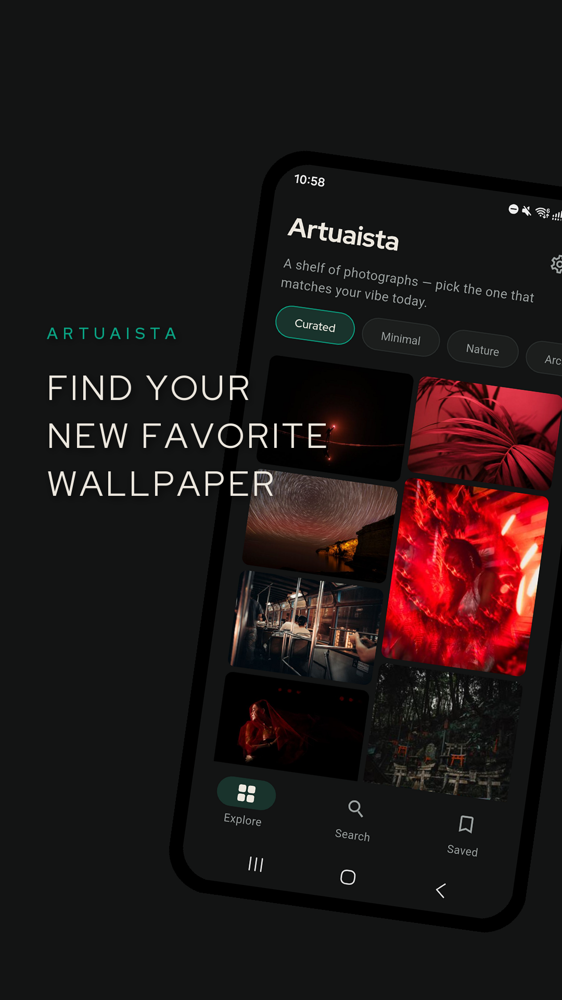
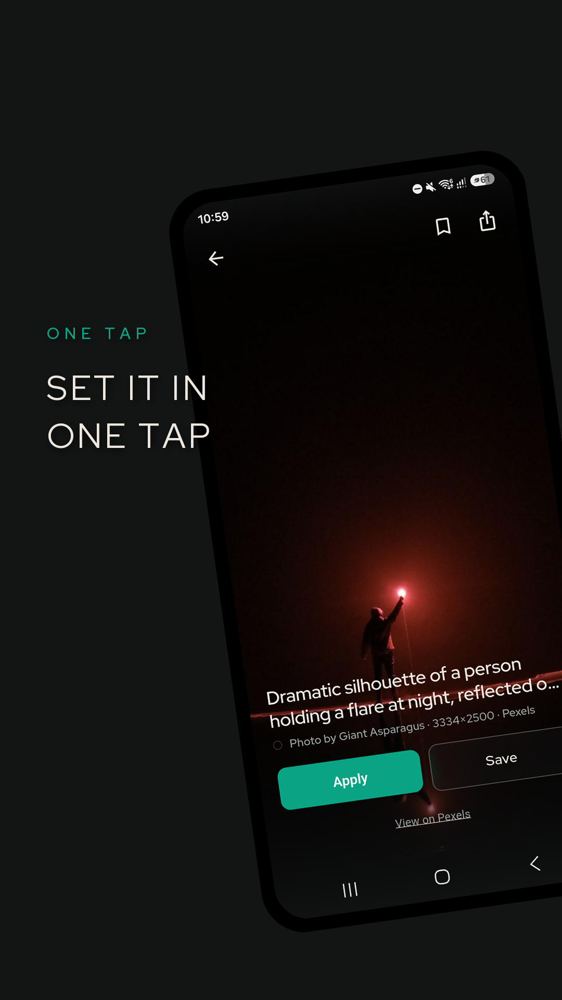
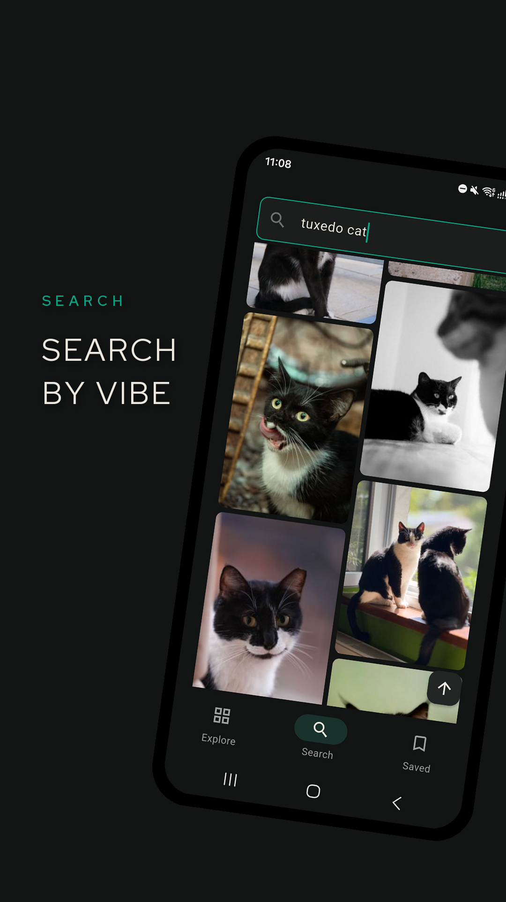
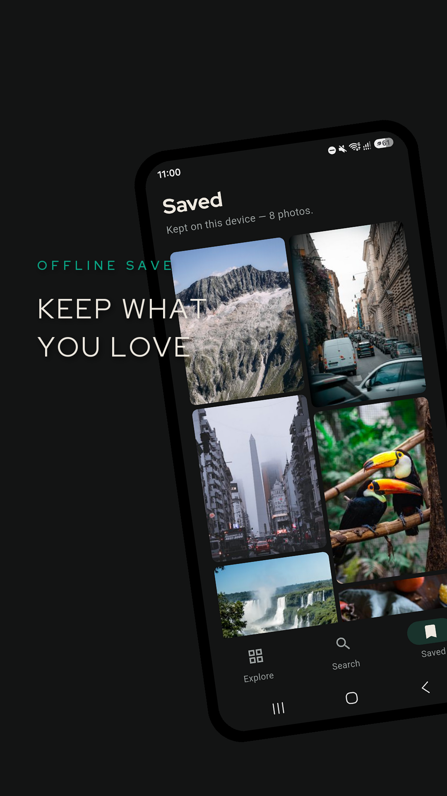
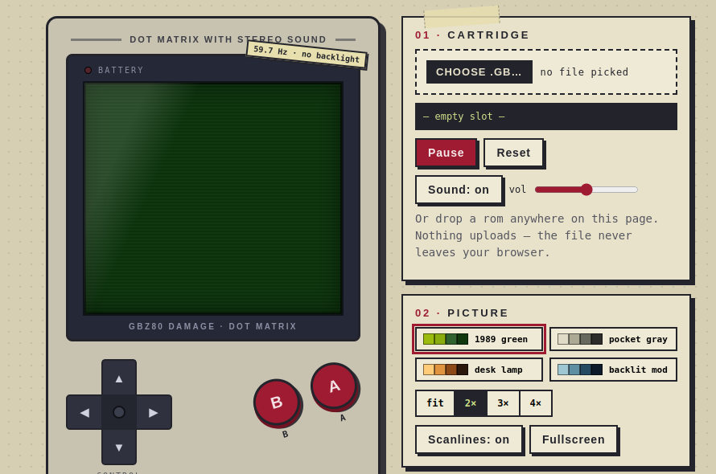

# Vinícius Resende

I build cross-platform mobile apps and the backend + web around them. Day-to-day full stack: mobile app, API, database, integrations in between and frontend when needed.

I'm a full-stack engineer at [Skorr](https://skorr.social).

## Work

      

- Mobile: Flutter / Dart, Kotlin, React Native
- Backend: TypeScript / Node
- Web: React
- Databases and APIs

As a full-stack developer specialized in mobile, I keep a generalist view of the problems to be solved overall — and as a mobile specialist I turn the solution into something that fits in your pocket.

## Selected projects

### [Artuaista](https://github.com/bleszerd/Artuaista) — wallpaper discovery in Flutter

   

Discover wallpapers that match you, instead of making you scroll forever. Curated Pexels photos, saved offline. Apply new wallpapers to your home screen, lock screen, or both. English + Português.

Builds: [Artuaista releases](https://github.com/bleszerd/Artuaista/releases).

### [gbz80_damage](https://github.com/bleszerd/gbz80_damage) — Game Boy emulator in TypeScript

Game Boy (DMG) emulator: CPU, PPU, APU, timers, MBC cartridges. Browser + terminal frontends. Built as a hobby to better understand how the hardware behaves. Live demo at [bleszerd.github.io/gbz80_damage](https://bleszerd.github.io/gbz80_damage/).

The rest includes experiments, course code, and prototypes — 60+ repos; honestly, not all worth your time. [Full list on GitHub](https://github.com/bleszerd?tab=repositories).

## How I work

They said AI would do all our work — today I use AI tooling to deliver faster: boilerplate, first drafts, docs. AI doesn't create, AI doesn't decide, it just **works** on top of the experience I built over 8+ years as a developer **who didn't start out with an AI in his pocket**.

Architecture, system design, and technical decisions are mine. If it's in one of my repos I can tell you how it all works.

## Contact

Best way is through GitHub — [you can open an issue here on GitHub](https://github.com/bleszerd/bleszerd/issues/new). If you don't know how, you can also send me an email: vinicius.aroliveira@gmail.com (or vinicius@catlover.com — seriously, I also use that address).
